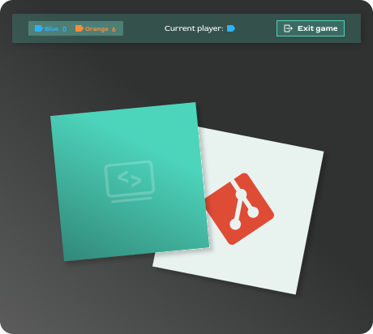

# Memory Game

## About the project

This is a memory game built with HTML, SCSS, and TypeScript.
Players can choose between different themes, board sizes, and starting players before starting the game.
The game includes score tracking, animated end screens, and persistent settings when navigating back to the settings page.

## Features

- multiple visual themes
- different board sizes
- theme preview in the settings screen
- score tracking for two players
- animated game-over, win, and draw screens
- localStorage-based settings persistence
- hover animations and theme-specific UI styling

## Technologies

- HTML5
- SCSS
- TypeScript
- LocalStorage
- Vite

## Preview

## Author

Nicole Gerlach
